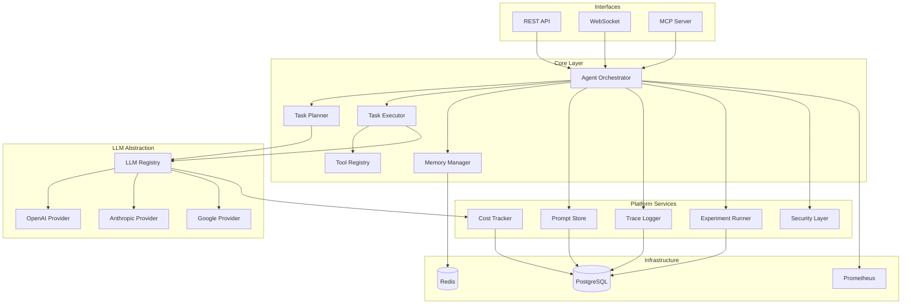

# BSAI - AI Agent Platform

**Platform-oriented AI Agent Orchestrator with comprehensive LLMOps capabilities**

## Overview

BSAI is an enterprise-grade AI agent platform that provides:

- **Multi-interface Support**: REST API, WebSocket streaming, and MCP (Model Context Protocol)
- **Multi-vendor LLM Integration**: Unified interface for OpenAI, Anthropic, Google, and more
- **Platform Features**: Prompt versioning, cost tracking, distributed tracing, A/B testing
- **Production-ready**: Built with observability, security, and scalability in mind

## Key Features

### 🤖 Agent Orchestration
- **Planning & Execution**: Intelligent task decomposition and execution
- **Memory Management**: Short-term (session) and long-term (knowledge) memory
- **Tool Integration**: Extensible tool registry for custom capabilities

### 🎯 Prompt Management
- **Version Control**: Git-style versioning for all prompts
- **Template System**: Jinja2-based dynamic prompt generation
- **Deployment Tracking**: Environment-specific prompt deployment

### 📊 Observability
- **Distributed Tracing**: OpenTelemetry-based request tracking
- **Cost Analytics**: Real-time token usage and cost monitoring
- **Performance Metrics**: Prometheus metrics for all operations

### 🔬 Experimentation Platform
- **A/B Testing**: Compare prompt variants in production
- **Evaluation Framework**: Automated prompt quality assessment
- **Results Dashboard**: Visualize experiment outcomes

### 🔒 Security & Compliance
- **PII Detection**: Automatic sensitive data filtering
- **Access Control**: Role-based authentication and authorization
- **Audit Logging**: Complete activity tracking for compliance

## Architecture



## Quick Start

```bash
# Install dependencies
pip install -r requirements.txt

# Configure environment
cp .env.example .env
# Edit .env with your API keys

# Run database migrations
alembic upgrade head

# Start the server
uvicorn src.agent_platform.main:app --reload
```

Visit [http://localhost:8000/api/docs](http://localhost:8000/api/docs) for interactive API documentation.

## Technology Stack

- **Framework**: FastAPI (async/await)
- **Database**: PostgreSQL with asyncpg
- **Cache**: Redis
- **LLM SDKs**: OpenAI, Anthropic, Google AI
- **Observability**: OpenTelemetry, Prometheus, Structlog
- **Testing**: pytest with async support
- **Documentation**: MkDocs Material

## Use Cases

### 1. Customer Support Agent
Intelligent agent with access to knowledge base, ticket system, and escalation tools.

### 2. Code Review Assistant
Automated code review with context from repository, commit history, and style guides.

### 3. Research Agent
Multi-step research workflows with web search, document analysis, and synthesis.

### 4. Data Analysis Pipeline
Orchestrated data processing with LLM-powered insights and reporting.

## Development Philosophy

### TDD (Test-Driven Development)
Every feature starts with tests. We maintain >90% code coverage.

### DDD (Documentation-Driven Development)
Architecture and API design are documented before implementation.

### Platform-First Thinking
Built for multi-tenancy, scalability, and operational excellence from day one.

## Next Steps

- [Installation Guide](guides/installation.md)
- [Architecture Overview](architecture/overview.md)
- [API Reference](api/rest.md)
- [Contributing Guide](guides/contributing.md)

## License

[Your License Here]

## Support

- GitHub Issues: [Report bugs or request features](https://github.com/yourusername/bsai/issues)
- Documentation: [Full documentation](https://bsai.readthedocs.io)
